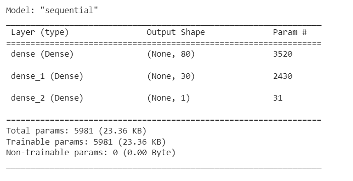
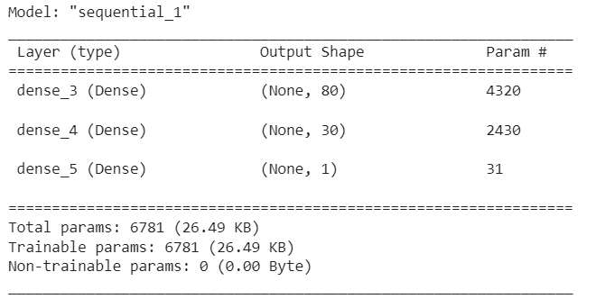
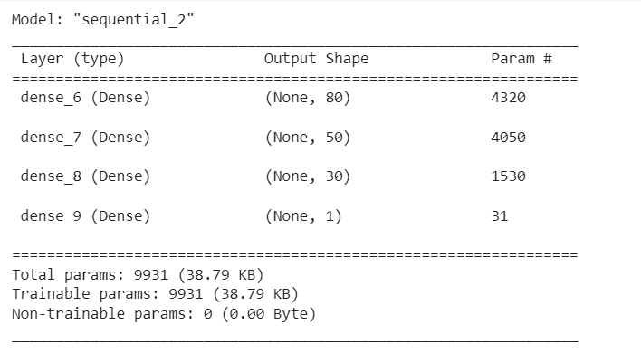
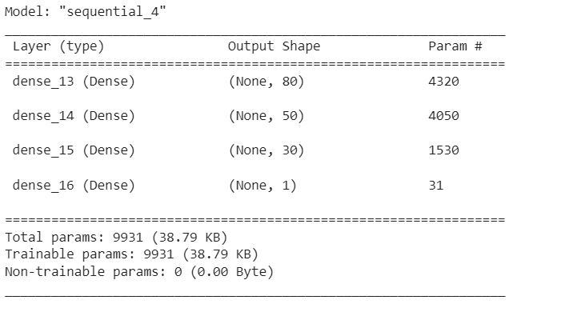

# Predicting Charity Success

## Overview
This project aims to develop a deep learning model using TensorFlow and Keras to predict whether a charity organization will be successful in its fundraising efforts. The dataset used contains various features of charity organizations, such as application type, classification, affiliation, and income amount. The target variable for the model is whether or not the charity was successful (binary classification).

## Results

### Data Preprocessing

- **Target Variable(s):** 'IS_SUCCESSFUL'
- **Features:** All columns except 'EIN' and 'NAME'
- **Variables Removed:** 'EIN', 'NAME'

#### Data Preprocessing with Cutoff Values

- **First Attempt:** Applied a cutoff value to determine rare occurrences in 'APPLICATION_TYPE' and 'CLASSIFICATION'.
- **Second Attempt:** Increased cutoff values for 'APPLICATION_TYPE' and 'CLASSIFICATION' to further consolidate less frequent categories.

### Compiling, Training, and Evaluating the Model

- **Model Architecture:**
    - 
    - 
    - 
    - 

#### Model Performance

- **Initial Model:** Accuracy ~72.7%
- **First Attempt:** Accuracy ~72.8%
- **Second Attempt:** Accuracy ~73.0%
- **Third Attempt:** Accuracy ~72.9%

## Summary

Overall, the deep learning model achieved moderate performance with an accuracy ranging from approximately 72.7% to 73.0%. While some improvements were observed with different model configurations, the target performance of higher than 75% accuracy was not met.

A different approach to solving this classification problem could involve trying different model architectures such as a Random Forest or Gradient Boosting Classifier.
